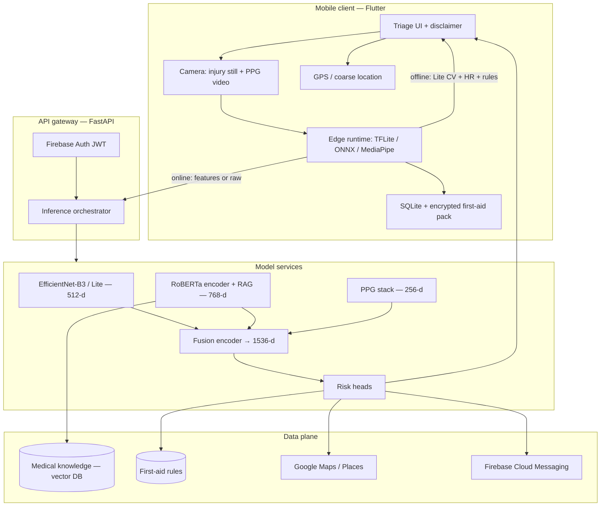

# Smart Emergency Sports App — Technical Architecture

**Document type:** Hackathon / college project architecture  
**System class:** Multimodal emergency *triage assistance* (not a diagnostic device)  
**Target hardware:** Mid-range Android/iOS, ~4 GB RAM, Snapdragon 600-class SoC  
**Latency SLO:** Full inference pipeline **< 3 s** (excluding the 30 s PPG capture window)  
**Status:** Prototype-ready design with a staged path to a more clinical-grade system

---

> **Medical disclaimer (must appear in-app, onboarding, and every result screen)**  
> This application is **not a medical device and not a diagnostic tool**. It provides **emergency triage assistance and first-aid decision support only**. It does not replace licensed clinicians, EMS, or 911 / local emergency services. If the injured person is unconscious, not breathing, bleeding heavily, or you suspect spinal / head injury, **call emergency services immediately**. Model outputs can be wrong; **confidence scores are not clinical certainty**.

---

## 1. Problem and design thesis

On a sports field, responders have three noisy signals: what the injury *looks like*, what the athlete *describes*, and what the body is *doing* (pulse, oxygenation, breathing). Each signal alone is brittle (a photo of a bruise is not shock; a chatbot cannot see arterial bleeding; PPG fails in motion and cold).

The system treats these as **complementary modalities**, fuses them with **cross-modal attention**, and produces:

| Output | Range | Role |
|---|---|---|
| Risk score | 0–100 | Continuous triage priority |
| Severity | Low / Medium / High | Coarse action band |
| Confidence | 0–1 | Whether to trust the score or escalate to “call EMS / incomplete data” |
| Top-3 risk indicators | Attention ranks | Explainability for the responder |
| Decision support | Text + maps + alerts | First aid, nearest hospital, emergency contacts |

**Design thesis for 4 GB phones:** put **cheap, always-available models on device**; put **heavy language and retrieval in the cloud**; never block a 911 path on model availability.

---

## 2. System architecture

### 2.1 Logical view



### 2.2 Layered (hexagonal) architecture

```
┌─────────────────────────────────────────────────────────────────┐
│ Presentation    Flutter screens, localizations, accessibility    │
├─────────────────────────────────────────────────────────────────┤
│ Application     Triage session FSM, consent, SLO timers          │
├─────────────────────────────────────────────────────────────────┤
│ Domain          RiskScore, Severity, ModalityFeatures, Guidance  │
├─────────────────────────────────────────────────────────────────┤
│ Ports           VisionPort, SymptomPort, PpgPort, FusionPort,    │
│                 MapsPort, AlertPort, KnowledgePort               │
├─────────────────────────────────────────────────────────────────┤
│ Adapters        TFLite, FastAPI client, Firebase, Maps SDK,      │
│                 encrypted SQLite, FCM                            │
└─────────────────────────────────────────────────────────────────┘
```

Domain objects **never** import Flutter or FastAPI. That keeps the fusion math testable in Python/PyTorch and the mobile UI swappable.

### 2.3 Session state machine

```
IDLE → CONSENT → CAPTURE_IMAGE → SYMPTOMS → CAPTURE_PPG
     → INFER → RESULT → (GUIDANCE | HOSPITALS | ALERT)
     → ABORT_CALL_EMS   (available from every state)
```

`ABORT_CALL_EMS` is a **hard interrupt**: no model wait, no network retry loop.

---

## 3. Model architecture (layer-by-layer)

### 3.1 Shared conventions

- **Training:** PyTorch; **export:** ONNX → TFLite INT8 (edge) or ONNX Runtime / TensorRT (cloud).
- **Feature L2-normalization** after each encoder so fusion attention is not dominated by vector magnitude.
- **Missing modality:** learnable `[MASK]` token of that modality’s width; confidence head is trained to drop when masks are used.
- **Image size:** specified **640×640 RGB**. On Snapdragon 600-class devices, run **letterbox 640** only in cloud; on device use **384×384** with the same class head (shared weights via distillation).

---

### 3.2 Computer vision — injury appearance

**Task:** Multi-label classification + 512-d embedding.  
**Classes:** `swelling`, `bruising`, `open_wound`, `abnormal_posture`, `bleeding`.

**Prototype choice:** **EfficientNet-B3** (cloud / teacher).  
**On-device student:** **EfficientNet-Lite0 / MobileNetV3-Small** distilled from B3 (hackathon-feasible).  
**Optional stretch:** ViT-S/16 as a second teacher; **do not** ship ViT-B on 4 GB RAM without NPU and INT8.

#### EfficientNet-B3 stem → 512-d (teacher)

| Stage | Operator | Resolution (approx.) | Channels | Repeat |
|---|---|---|---|---|
| 0 | Conv 3×3, stride 2 | 640 → 320 | 40 | 1 |
| 1 | MBConv1, k3 | 320 | 24 | 2 |
| 2 | MBConv6, k3 | 160 | 32 | 3 |
| 3 | MBConv6, k5 | 80 | 48 | 3 |
| 4 | MBConv6, k3 | 40 | 96 | 5 |
| 5 | MBConv6, k5 | 40 | 136 | 5 |
| 6 | MBConv6, k5 | 20 | 232 | 6 |
| 7 | MBConv6, k3 | 20 | 384 | 2 |
| 8 | Conv 1×1 | 20 | 1536 | 1 |
| Pool | Global average pool | 1×1 | 1536 | — |
| Proj | Dense 1536 → 512, GELU, L2-norm | — | **512** | — |
| Head | Dense 512 → 5, sigmoid (multi-label) | — | 5 | — |

Auxiliary **severity indicators** (not mutually exclusive): `active_bleed`, `deformity_hint`, `skin_break`. Same GAP vector, separate linear heads. The **512-d vector is the fusion input**; class logits are also passed as side information to the first-aid rules engine.

**Preprocessing:** EXIF orientation → center-crop / letterbox to 640 → ImageNet mean/std → optional CLAHE on V channel for field lighting.

---

### 3.3 Symptom analysis — text encoder + RAG

**Hackathon / 4 GB reality:** **DistilRoBERTa** or **RoBERTa-base** (768-d). **LLaMA-2-7B does not fit** in 4 GB with a usable OS, camera pipeline, and CV model. Use LLaMA-2-7B **only as a cloud generator** for first-aid phrasing, never as the on-device embedder.

#### RoBERTa-base encoder (768-d)

| Layer | Detail |
|---|---|
| Tokenizer | BPE, max 128 tokens (symptoms are short) |
| Embeddings | Token + position (+ optional token type) |
| Encoder | 12 × Transformer block, hidden 768, 12 heads, FFN 3072, GELU |
| Pooling | `[CLS]` (index 0) **or** mean of non-padding tokens (prefer mean for short symptoms) |
| Output | **768-d** L2-normalized `h_text` |

Fine-tune with **triplet / InfoNCE** against first-aid article titles + a **multi-label symptom taxonomy** (pain location, mechanism of injury, neuro symptoms, consciousness).

#### RAG (cloud, optional on Wi-Fi)

```
h_text ──► vector search (FAISS / Chroma / pgvector)
              k = 4 chunks, cosine, metadata filter: sport + body-region
              ↓
         rerank (cross-encoder MiniLM) 
              ↓
         prompt pack: retrieved snippets + risk band + class labels
              ↓
         small instruction model (cloud) OR template fill (offline)
```

**Offline:** skip generation; retrieve from a **bundled SQLite FTS5** first-aid pack (~2–5 MB) using keyword + embedding of DistilRoBERTa if the Lite model is on device.

**LLaMA-2-7B (cloud-only, stretch):** 4-bit QLoRA adapter for “rewrite this rule card in calm, numbered steps.” Hard cap: 8 sentences, no invented drugs, no closed-reduction instructions.

---

### 3.4 Vital signs AI — smartphone PPG

**Input:** 30 s RGB video, rear camera, fingertip covering the lens **or** face rPPG fallback (lower SNR).  
**Note:** 30 s is **acquisition**, not inference. The < 3 s SLO starts when the buffer is closed.

#### Preprocessing (shared)

| Step | Method |
|---|---|
| ROI | Fingertip: center 40% of frame; rPPG: face bbox (MediaPipe) |
| Trace | Per-frame mean of **G** (HR/RR); **R and B** retained for SpO2 ratios |
| Denoise | Discrete wavelet (Daubechies-4), soft threshold |
| Detrend | Smoothness priors or high-pass 0.5 Hz |
| Normalize | z-score per window |
| Motion | Accelerometer magnitude + optical-flow energy as quality gate |

If quality gate fails → **do not invent vitals**. Set vital token to `[MASK]`, lower confidence, surface “finger placement / stay still.”

#### 3.4.a Heart rate — 1D-CNN + LSTM → BPM

Input: `T ≈ 900` samples (30 s × 30 Hz) or resampled 25–60 Hz, shape `(T, 1)`.

| Layer | Shape (example) | Notes |
|---|---|---|
| Conv1d 7, 16, ReLU, BN | T × 16 | Local pulse morphology |
| MaxPool 2 | T/2 × 16 | |
| Conv1d 5, 32, ReLU, BN | T/2 × 32 | |
| MaxPool 2 | T/4 × 32 | |
| Conv1d 3, 64, ReLU | T/4 × 64 | |
| BiLSTM hidden 64 | T/4 × 128 | Temporal pulse intervals |
| Attention pool | 128 | |
| Dense 64, ReLU | 64 | |
| Dense 1 | **BPM** | Train with Huber loss vs. pulse-ox / Polar H10 |

Valid range clamp: 40–200 BPM; outside → reject window.

#### 3.4.b SpO2 — ViT on RGB ratio patches → %

Classic Beer–Lambert smartphone SpO2 is **AC/DC of R and IR**; phone cameras lack IR. Treat this as a **learned proxy**, not clinical SpO2.

| Stage | Detail |
|---|---|
| Frame stack | 32 uniformly sampled frames, 64×64 ROI |
| Ratio maps | `(R/G)`, `(B/G)`, plus raw G as 3 channels |
| Patch embed | 8×8 patches → 64 tokens, dim 128 |
| ViT | 4 layers, 4 heads, MLP 256 |
| CLS → Dense 64 → 1 | **SpO2 %** |

Clamp 80–100; below 90 **and** high confidence → force High severity band regardless of image (safety override). Prototype labels will be noisy; document as **research-grade**.

#### 3.4.c Respiratory rate — Transformer on PPG + motion → breaths/min

| Stage | Detail |
|---|---|
| PPG envelope | Hilbert or 0.1–0.5 Hz band of G trace |
| Motion | Accel z (if available) or frame-intensity respiratory modulation |
| Tokens | 30 non-overlapping 1 s windows × (ppg_feat ⊕ motion_feat) |
| Transformer | 2 layers, 4 heads, dim 64 |
| Pool → Dense | **breaths/min** |

Clamp 6–40; apnea-like values + low motion → escalate.

#### Vital feature vector (256-d)

Concatenate and project:

`[hr_scalar, spo2_scalar, rr_scalar, quality_3, cnn_lstm_128, spo2_cls_64, rr_pool_64]`  
→ LayerNorm → Dense 256 → GELU → L2-norm → **`h_vital` (256-d)**.

---

### 3.5 Multimodal fusion — cross-modal transformer

**Constraint match:** 4-layer encoder, 8 heads, unified **1536-d** representation.

**Why 1536:** `512 + 768 + 256 = 1536`. Fusion does **not** smash modalities into one 512-d soup and throw away capacity. Each modality is projected to a **shared d_model = 512**, attended, then **concatenated after pooling**.

```
h_img  (512) --W_i--> t_img (512)
h_txt  (768) --W_t--> t_txt (512)
h_vit  (256) --W_v--> t_vit (512)
                      + modality embeddings e_i, e_t, e_v
                      + optional [CLS] (512)

X ∈ R^{4 × 512}   # CLS, img, txt, vit

for ℓ in 1..4:
  X = TransformerEncoderLayer(
        d_model=512,
        nhead=8,              # 64-d per head
        dim_feedforward=2048,
        dropout=0.1,
        activation=GELU,
        norm_first=True
      )(X)

# Cross-modal attention is standard MHSA over the 4 tokens
# (each token can attend to every other modality).

z_img, z_txt, z_vit = X[1], X[2], X[3]
u = concat(z_img, z_txt, z_vit)     # 1536-d unified representation
```

**Top-3 risk indicators:** average the last-layer attention from `CLS` (or from a dedicated query) onto `{img, txt, vit}` **and** onto a **8-bin concept probe** (linear maps from each `z_*` to concept scores: bleeding, airway, shock-vitals, neuro, deformity, pain, hypoxia, unstable-HR). Take top 3 concepts with weights.

---

### 3.6 Risk prediction head

Input: `u ∈ R^{1536}`.

```
h = Dense(256, ReLU)(u)
h = Dropout(0.3)(h)
h = Dense(128, ReLU)(h)

risk_raw     = Dense(1)(h)           # linear
risk_score   = 100 * sigmoid(risk_raw)    # 0–100 regression (train with scaled MSE / Huber)

sev_logits   = Dense(3)(h)
severity     = softmax(sev_logits)        # Low / Medium / High

conf         = sigmoid(Dense(1)(h))       # 0–1

indicators   = top3(attention + concept probes)  # not a dense “hallucinated” list
```

**Training losses (weighted sum):**

- Risk: Huber on expert 0–100 labels (or ordinal mapping from START/triage tags).
- Severity: label-smoothed CE.
- Confidence: predicted vs. *correctness* (1 if severity matches, 0 else) **or** evidential / MC-dropout variance (prototype: correctness).
- Auxiliary: multi-label CV BCE + vital regression.

**Safety overrides (rules beat the net):**

1. User taps “unconscious / not breathing” → High, risk ≥ 95, skip wait.  
2. SpO2 < 90 with quality OK → at least High.  
3. `bleeding` AND `open_wound` AND HR > 120 → at least High.  
4. Confidence < 0.4 → UI: “Insufficient data — if in doubt, call EMS.”

---

### 3.7 Decision support

| Module | Method | Online | Offline |
|---|---|---|---|
| First-aid generator | **Rules first** (WHO/Red Cross-style cards keyed by class + severity). LLM **rewrites tone** only when online | Template + LLaMA/GPT | Bundled cards |
| Hospital locator | GPS → Google Places `hospital` / `emergency_room`, distance + open-now | Maps SDK | Cached last-known hospitals + OSM extract (city pack) |
| Emergency contacts | User-configured list + ICE; **FCM** data message + SMS fallback | FCM | Local SMS intent / tel: |

**Rule sketch:**

```
if severity == High or risk >= 70:
    show("Call emergency services")
    disable_delay_on_call_button()
if classes.contains(bleeding):
    card = "direct_pressure_elevation_do_not_remove_impaled"
if classes.contains(abnormal_posture) and mechanism == "fall_or_collision":
    card = "do_not_move_suspect_spine"
...
guidance = fill_template(card, vitals, language)
if online: guidance = llm_rewrite(guidance, constraints)
```

---

## 4. Data flow (input → preprocess → infer → output)

```
┌──────────────┐   ┌──────────────┐   ┌──────────────┐
│ Injury photo │   │ Symptom text │   │ 30s PPG video│
│ 640×640 RGB  │   │  chatbot     │   │ RGB + IMU    │
└──────┬───────┘   └──────┬───────┘   └──────┬───────┘
       │                  │                  │
       ▼                  ▼                  ▼
  letterbox/norm     tokenize 128       ROI, wavelet,
  quality check      PII scrub          detrend, z-score
       │                  │                  │
       ▼                  ▼                  ▼
  EfficientNet*      RoBERTa/Distil     HR CNN-LSTM
  → 512-d + 5-hot    → 768-d            SpO2 ViT
                     RAG (if online)    RR Transformer
                                        → 256-d
       │                  │                  │
       └────────────► Fusion 4×512, 8 heads ◄┘
                            │
                            ▼
                      u = 1536-d
                            │
                            ▼
                 Dense 256 → Drop 0.3 → Dense 128
                            │
          ┌────────────┬────┴─────┬─────────────┐
          ▼            ▼          ▼             ▼
      Risk 0–100   Severity   Confidence    Top-3 attn
          │            │          │             │
          └────────────┴────┬─────┴─────────────┘
                            ▼
                 Rules + optional LLM rewrite
                 Maps + FCM (if consented)
                            ▼
                 Result UI + always-visible EMS CTA
```

**End-to-end latency budget (inference only, p95 < 3000 ms):**

| Stage | Edge target (ms) | Cloud add-on (ms) |
|---|---|---|
| Image preprocess | 50–100 | — |
| CV (INT8 Lite) | 250–700 | B3 GPU 80–150 |
| Text encode | 40–150 | RoBERTa 20–40 |
| PPG models (after capture) | 80–250 | 30–80 |
| Fusion + heads | 10–40 | 5–15 |
| Rules / templates | 5–20 | — |
| RAG + LLM rewrite | skip offline | 400–1500 (async, UI not blocked) |
| **Synchronous path** | **~500–1300** | **keep < 3 s or fail open** |

Maps and FCM are **post-result** and must not gate the risk card.

---

## 5. Technology stack

### 5.1 Recommendation (hackathon)

| Layer | Choice | Why |
|---|---|---|
| Mobile | **Flutter 3.x** | One codebase, decent camera plugins, FFI to TFLite, fast UI |
| Alt mobile | React Native + Expo | Only if the team is JS-only; camera PPG is harder |
| On-device ML | **TFLite** + GPU delegate / NNAPI | Snapdragon 600 may have weak DSP; CPU INT8 is the fallback |
| Vision helpers | ML Kit / MediaPipe | Face ROI, pose (abnormal posture assist) |
| Backend | **FastAPI** (Python 3.11) | Same language as training; Pydantic schemas for features |
| Serving | ONNX Runtime **or** TorchServe for demo; one GPU VM | Keep it one box for judging |
| Auth / push / store | **Firebase** Auth + Cloud Messaging + Firestore (session metadata only) | Fastest path for contacts and alerts |
| Maps | Google Maps SDK + Places | Hospital locator |
| Vector KB | Chroma or FAISS on the API box | Zero ops for a demo |
| Secrets | Firebase App Check + API keys in Cloud Functions, not in APK | |

**Do not** put raw PHI in Firestore documents in plaintext. Prefer **on-device session blobs** + optional encrypted upload.

### 5.2 Suggested repo layout

```
app/                    # Flutter
  lib/
    domain/
    application/
    adapters/
      tflite/
      api/
      firebase/
server/                 # FastAPI
  routers/
  inference/
  rag/
ml/
  train/
  export_tflite.py
  cards/                # first-aid YAML
infra/
  docker-compose.yml
```

---

## 6. Edge vs cloud deployment

### 6.1 Split (authoritative)

| Component | Edge (offline) | Cloud (online) |
|---|---|---|
| Disclaimer, EMS button, contacts `tel:` | **Required** | — |
| First-aid **rule cards** | Bundled YAML/SQLite | LLM rewrite |
| HR (1D-CNN+LSTM) INT8 | **Yes** | Optional refine |
| RR transformer (tiny) | **Yes** | Optional |
| SpO2 ViT | Lite CNN fallback on device; full ViT in cloud | **Preferred** |
| EfficientNet-B3 640 | No (RAM/latency) | **Yes** |
| EfficientNet-Lite 384 | **Yes** | Teacher sync |
| RoBERTa-base | Distil only if quantized < ~150 MB | **Yes** |
| LLaMA-2-7B | **Never** on 4 GB | Optional rewrite |
| Fusion 4-layer | **Yes** (tiny, 4 tokens) | Same weights |
| RAG | FTS5 | Vector + rerank |
| Maps / FCM | Last cache / SMS | Live |

### 6.2 Orchestration policy

```
if network_ok and battery_ok:
    send {features or images per consent}
    t_cloud = wait(deadline=2.2s)
    if t_cloud.ok: use cloud (B3 + RoBERTa + RAG)
    else: use edge logits, badge "offline estimate"
else:
    edge only
always: local rules + EMS CTA
```

Images: **default do not upload**. Upload only after explicit consent (“send photo to improve triage”). Prefer uploading **512-d features** when the student model ran on device.

### 6.3 Memory envelope (4 GB)

Rough concurrent budget:

- OS + Flutter + camera: ~1.2–1.8 GB  
- TFLite Lite-CV + PPG + fusion: **target < 250 MB** allocated  
- Leave headroom; **never** co-load B3 + LLaMA.

---

## 7. Privacy, security, and HIPAA-oriented controls

A student hackathon app is typically **not** a HIPAA “covered entity,” but **sports injury photos, symptoms, GPS, and vitals are sensitive health data**. Design as if a future clinic partnership required HIPAA-like safeguards. That is also the honest story for a college jury.

### 7.1 Data minimization

- Collect **only** what the current triage session needs.  
- Default **no cloud photos**.  
- PPG video **deleted** after feature extraction (secure delete).  
- Location used for hospital search; **not** stored as a track.  
- Chat text: strip names/IDs with a simple NER/regex scrub before RAG.

### 7.2 Security controls (prototype → “HIPAA-ready”)

| Control | Prototype | HIPAA-ready |
|---|---|---|
| Transit | HTTPS / TLS 1.2+ | TLS 1.2+, HSTS |
| At rest | Android Keystore / iOS Keychain for tokens; SQLCipher for local sessions | Same + CMEK in cloud |
| Auth | Firebase Auth | + enterprise IdP, MFA for admin |
| Access | Single demo admin | RBAC, unique user IDs, minimum necessary |
| Audit | Request logs without bodies | Immutable audit log of PHI access |
| BAA | N/A | BAA with Firebase/GCP/Maps if PHI hits their systems |
| Retention | 24 h auto-wipe on device | Documented retention + patient rights workflow |
| App | App Check, no secrets in client | Threat model, pen-test |

**Firebase note:** using Firestore/FCM with identifiable health content can pull those vendors into the compliance boundary. **Keep PHI on device** for the prototype; send **anonymous risk scores** or **hashed session IDs** if you need a live dashboard.

### 7.3 Consent UX

1. Medical disclaimer (scroll + tap).  
2. Camera / location / contacts permissions **just-in-time**.  
3. Separate toggle: “Share data with backend for this session.”  
4. Emergency alert: confirm before notifying contacts (except user-defined “auto-alert if High”).

### 7.4 Model risk

- Calibrate; show confidence.  
- No “you have a fracture” language — use “possible serious injury — seek emergency care.”  
- Log **model version** with each session for reproducibility in the report.

---

## 8. Datasets, labels, and evaluation (for the report)

| Modality | Prototype data | Honest limitation |
|---|---|---|
| Images | Public wound/bruise datasets + team-captured sports photos with consent | Domain gap vs. real ER |
| Text | Symptom–triage pairs from first-aid manuals (not MIMIC unless licensed) | Not EHR-grade |
| PPG | UBFC / PURE / team pulse-ox paired captures | Skin tone and motion bias |
| Fusion labels | Expert Likert + START-like tags on staged scenarios | Small-n |

**Metrics:** AUROC / F1 on severity; MAE on risk and vitals; ECE for confidence; **time-to-first-action** in user study; **offline success rate** with airplane mode.

---

## 9. Hackathon build order (what to actually ship)

**Day 1 — vertical slice:** Flutter shell, disclaimer, EMS button, 5-class CV on Lite, rule cards.  
**Day 2 — vitals:** 30 s PPG HR only (green channel FFT or tiny CNN); skip SpO2 ViT if short on time (use ratio heuristic + big disclaimer).  
**Day 3 — language:** DistilRoBERTa or even **keyword + MiniLM** embeddings; RAG over 20 first-aid chunks.  
**Day 4 — fusion:** 4-token transformer **or** a MLP on concat(512,768,256) if training data is tiny — document as ablation.  
**Day 5 — maps + FCM + polish + latency measurements on a 4 GB phone.**

**Jury talking point:** you specified B3, RoBERTa 768-d, LLaMA, and ViT SpO2 because that is the **research architecture**; the **shipped binary** is the distilled edge path with the same interfaces (`h_img`, `h_txt`, `h_vital`, `u`). That is how real medical-adjacent products launch.

---

## 10. Interface contracts (for implementation)

```json
{
  "session_id": "uuid",
  "model_version": "fusion-v0.3.1",
  "modalities_present": ["image", "text", "vitals"],
  "features": {
    "h_img": "<float32[512]>",
    "h_txt": "<float32[768]>",
    "h_vital": "<float32[256]>"
  },
  "cv_labels": {
    "swelling": 0.81,
    "bruising": 0.44,
    "open_wound": 0.12,
    "abnormal_posture": 0.05,
    "bleeding": 0.09
  },
  "vitals": { "hr_bpm": 98, "spo2": 97, "rr": 18, "quality": 0.72 },
  "outputs": {
    "risk_score": 34.2,
    "severity": "Low",
    "confidence": 0.66,
    "top_indicators": [
      { "id": "pain_mechanism", "weight": 0.41 },
      { "id": "swelling", "weight": 0.33 },
      { "id": "hr_elevated", "weight": 0.18 }
    ]
  },
  "guidance_id": "rice_soft_tissue_v2",
  "disclaimer_shown": true
}
```

---

## 11. Non-goals

- Automated diagnosis, fracture detection as a clinical claim, or closed reduction.  
- Replacing EMS dispatch.  
- Training on identifiable patient records without IRB/ethics approval.  
- Running LLaMA-2-7B on Snapdragon 600.

---

## 12. References to cite in a presentation

- Tan & Le, *EfficientNet* (ICML 2019).  
- Dosovitskiy et al., *ViT* (ICLR 2021).  
- Liu et al., *RoBERTa* (2019).  
- Touvron et al., LLaMA 2 (2023) — **cloud generator only**.  
- Classic rPPG / PPG: POS, CHROM, wavelet denoising literature; smartphone SpO2 **limitations**.  
- START / field triage as **label inspiration**, not a certified implementation.  
- HIPAA Security Rule (45 CFR 164.312) as a **control checklist**, not a claim of certification.

---

*End of architecture document. Pair with the interactive architecture canvas in Cursor for diagrams, latency budget, and stack tables during the demo.*
