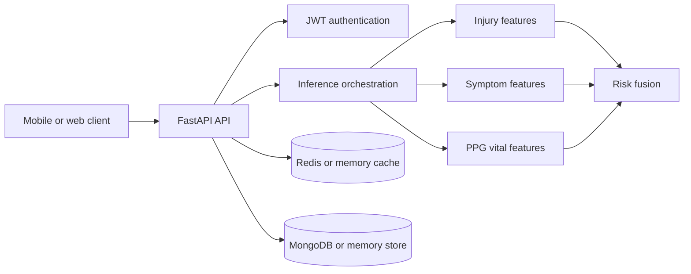

# Smart Emergency Sports App

Multimodal emergency triage assistance for sports-field incidents. The project combines injury-image signals, reported symptoms, and smartphone-based vital-sign estimates to help athletes, coaches, and medical staff make faster first-aid and escalation decisions.

> **Medical and safety notice**
>
> This project is a prototype for emergency triage assistance and first-aid decision support. It is **not a medical device, diagnostic tool, or substitute for a licensed clinician, EMS, or local emergency services**. Model outputs can be wrong, and confidence scores are not clinical certainty. If someone is unconscious, not breathing, bleeding heavily, or may have a head or spinal injury, call emergency services immediately.

## Project Status

The repository currently contains a working FastAPI prototype, Python signal-processing and ML modules, fusion model artifacts, API tests, and design documentation. The Flutter mobile client and clinician dashboard described in the design documents are part of the target product architecture and are not included in this checkout.

## Capabilities

- JWT-authenticated API with athlete and clinician demo roles
- Injury analysis from a base64-encoded image and reported symptoms
- Symptom extraction and embedding generation
- Smartphone video vital-sign estimation with quality-aware fallback behavior
- Multimodal risk assessment with a 0–100 score, severity band, confidence, and top indicators
- Nearby hospital search with distance, travel estimate, emergency availability, and caching
- Incident creation, access-controlled incident detail, timelines, and emergency contact alerts
- Health endpoint and generated OpenAPI documentation
- Local in-memory development adapters with optional Redis and MongoDB configuration

## Architecture



See [ARCHITECTURE.md](ARCHITECTURE.md) for the complete model, data, state-machine, and deployment design. See [docs/UI_UX_SPEC.md](docs/UI_UX_SPEC.md) for the intended client experience and accessibility requirements.

## Repository Layout

| Path | Purpose |
| --- | --- |
| `server/app/` | FastAPI application, authentication, schemas, inference, storage, and caching |
| `server/tests/` | API and unit test suite |
| `ml/ppg/` | PPG preprocessing, heart-rate, respiratory-rate, SpO2, quality, and video utilities |
| `ml/fusion/` | Fusion dataset, model, training, and evaluation code |
| `artifacts/fusion/` | Fusion checkpoints, training history, and evaluation metrics |
| `docs/` | UI/UX product specification |

## Quick Start

### Requirements

- Python 3.11+
- pip
- Optional: Docker Desktop and Docker Compose

### Run the API locally

From the repository root:

```powershell
python -m venv .venv
.\.venv\Scripts\Activate.ps1
python -m pip install --upgrade pip
python -m pip install -r server\requirements.txt
$env:PYTHONPATH = "server;."
python -m uvicorn app.main:app --app-dir server --reload --port 5674
```

The API is available at `http://localhost:5674`.

- Health check: `http://localhost:5674/health`
- Swagger UI: `http://localhost:5674/docs`
- OpenAPI JSON: `http://localhost:5674/openapi.json`

### Run with Docker Compose

```powershell
docker compose -f server\docker-compose.yml up --build
```

This starts the API on port `5674` and Redis on port `6379`.

## Configuration

The API loads environment variables from `.env`. Important settings include:

| Variable | Default | Description |
| --- | --- | --- |
| `JWT_SECRET` | `dev-only-change-in-production` | Secret used to sign access tokens |
| `JWT_EXPIRE_MINUTES` | `720` | Token lifetime |
| `CORS_ORIGINS` | `*` | Comma-separated allowed origins |
| `REDIS_URL` | unset | Optional Redis cache URL |
| `MONGO_URI` | unset | Optional MongoDB connection string |
| `RATE_LIMIT_PER_MINUTE` | `100` | Per-user request limit |
| `MAX_IMAGE_BYTES` | `8388608` | Maximum accepted image payload |
| `MAX_VIDEO_BYTES` | `20971520` | Maximum accepted video payload |

For any non-development deployment, set a strong `JWT_SECRET`, restrict `CORS_ORIGINS`, use managed data stores, enable TLS, and replace the demo authentication flow with a production identity provider.

## Authentication

The prototype exposes demo credentials for local development:

| Username | Password | Role |
| --- | --- | --- |
| `athlete` | `athlete-demo` | `athlete` |
| `clinician` | `clinician-demo` | `clinician` |

Obtain a token with:

```powershell
curl.exe -X POST http://localhost:5674/api/v1/auth/token `
  -H "Content-Type: application/json" `
  -d '{"username":"athlete","password":"athlete-demo"}'
```

Send the returned token on protected requests using `Authorization: Bearer <token>`. Demo credentials and the development JWT secret must never be used in production.

## API Surface

All protected endpoints require a bearer token. Request and response schemas are available in Swagger UI.

| Method | Endpoint | Purpose |
| --- | --- | --- |
| `GET` | `/health` | Service health and version |
| `POST` | `/api/v1/auth/token` | Issue a demo JWT |
| `POST` | `/api/v1/injury/analyze` | Analyze injury image and context |
| `POST` | `/api/v1/symptoms/analyze` | Extract symptom entities and features |
| `POST` | `/api/v1/vitals/estimate` | Estimate vitals from video data |
| `POST` | `/api/v1/risk/assess` | Fuse modality features into a risk assessment |
| `GET` | `/api/v1/hospitals/nearby` | Find nearby hospitals |
| `POST` | `/api/v1/incident/create` | Create an incident record |
| `GET` | `/api/v1/incident/{incident_id}` | Retrieve an authorized incident |
| `POST` | `/api/v1/emergency/alert` | Record emergency contact notifications |

Analysis responses include an explicit disclaimer. Vital estimates are labeled as non-medical-grade estimates, and low-quality PPG input is not silently converted into invented measurements.

## Testing

Install the server dependencies, then run from the repository root:

```powershell
python -m pytest server\tests -q
```

The suite covers health checks, authentication, validation errors, analysis endpoints, risk caching, hospital search, incident authorization, and emergency alerts.

## ML Development

The fusion training and evaluation dependencies are separate from the API dependencies:

```powershell
python -m pip install -r ml\fusion\requirements.txt
```

The checked-in checkpoints and metrics are in `artifacts/fusion/`. PPG-specific dependencies are listed in `ml/ppg/requirements.txt`. Review the architecture document before treating any model output as suitable for a new environment, population, or clinical workflow.

## Roadmap

- Flutter athlete and coach client with offline first-aid content
- Clinician web dashboard and incident feed
- On-device model export and quantization
- Real hospital, maps, push-notification, and emergency-service integrations
- Production identity, audit logging, consent, encryption, monitoring, and model evaluation
- Prospective validation, bias analysis, calibration, and formal safety review

## License

No license file is currently included. Add an explicit license before distributing or accepting external contributions.