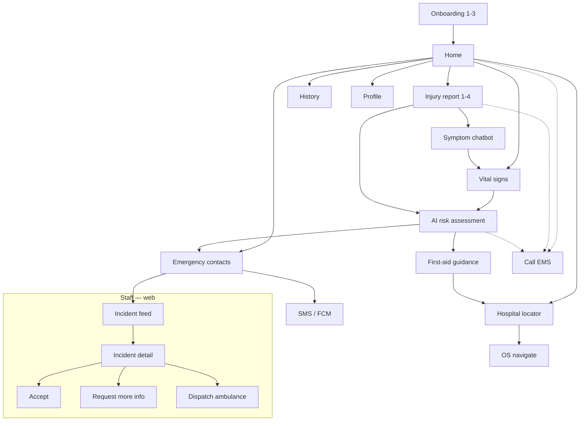

# Smart Emergency Sports App — UI/UX Design Specification

**Platform:** Flutter 3 (iOS, Android); Doctor Dashboard = Flutter Web (≥1024 px)  
**Users:** Athletes, coaches, sports medical staff (field, often in sun/glare)  
**Principle:** One obvious next action. Calling EMS is never behind a model.  
**Status:** Implementation spec for a hackathon / college prototype (not a medical device)

---

## 0. Design principles

1. **Emergency first.** A persistent **Call emergency services** control is on every authenticated screen (56 pt height, full-width or right FAB that does not cover primary CTAs). It uses `tel:` and does not wait on network or AI.
2. **One primary CTA.** Red is reserved for injury / danger / EMS — never for decorative branding on every chip.
3. **Outdoor legibility.** High-contrast theme is the default on the field; dark mode is for indoor/night. Contrast ≥ 4.5:1 (WCAG AA) for body; ≥ 3:1 for large type.
4. **Icons, not emoji.** Production UI uses Material Symbols (`Icons.local_hospital`, etc.). Emoji in this brief are copy examples only.
5. **Honest AI.** Every score, vital, and first-aid card sits under a visible disclaimer: *Not a diagnostic tool. Triage assistance only.*
6. **44×44 pt minimum** hit targets (48×48 pt preferred for primary actions). Body text **≥ 16 sp**.

---

## 1. Color palette

Semantic tokens (implement as `AppColors` + `ColorScheme` light/dark/highContrast).

| Token | Light | Dark | High-contrast outdoor | Use |
|---|---|---|---|---|
| `primary` / danger | `#FF3B30` | `#FF453A` | `#FF2D20` on `#FFFFFF` | Report injury, EMS, High severity |
| `secondary` | `#007AFF` | `#0A84FF` | `#0050C7` | Vitals, links, info |
| `success` | `#34C759` | `#30D158` | `#0B7A2F` | Low severity, available ER |
| `warning` | `#FF9500` | `#FF9F0A` | `#B85A00` | Medium severity, quality warn |
| `bg` | `#F2F2F7` | `#000000` | `#FFFFFF` | Scaffold |
| `surface` | `#FFFFFF` | `#1C1C1E` | `#FFFFFF` | Cards |
| `surface2` | `#E5E5EA` | `#2C2C2E` | `#E8E8E8` | Inputs, chips |
| `text` | `#1C1C1E` | `#F5F5F7` | `#000000` | Body |
| `textMute` | `#6C6C70` | `#A1A1A6` | `#3A3A3C` | Captions (must still pass AA) |
| `stroke` | `#D1D1D6` | `#38383A` | `#000000` | Hairlines 1 pt |
| `overlay` | `#00000099` | `#000000CC` | `#000000B3` | Modal scrim |

**Do not** put large red fills behind red text. High severity = red **badge** + black/white text, not red-on-red.

**Severity mapping:** Low `success` · Medium `warning` · High `primary`.

```dart
// lib/theme/app_colors.dart (excerpt)
class AppColors {
  static const primary = Color(0xFFFF3B30);
  static const secondary = Color(0xFF007AFF);
  static const success = Color(0xFF34C759);
  static const warning = Color(0xFFFF9500);
}
```

---

## 2. Typography scale

Font: **SF Pro** (iOS), **Roboto** (Android), or **Inter** bundled for parity. `textScaleFactor` must honor OS up to 1.3× without clipping primary CTAs (wrap, don’t shrink below 16 sp).

| Style | Size / line | Weight | Flutter | Use |
|---|---|---|---|---|
| Display | 34 / 41 | 700 | `displaySmall` | Risk score number |
| H1 | 28 / 34 | 700 | `headlineMedium` | Screen titles |
| H2 | 22 / 28 | 600 | `headlineSmall` | Section titles |
| H3 | 18 / 24 | 600 | `titleMedium` | Card titles |
| Body | 16 / 24 | 400 | `bodyLarge` | Default copy |
| Body emphasis | 16 / 24 | 600 | `bodyLarge` + w600 | Instructions |
| Caption | 13 / 18 | 400 | `bodySmall` | Timestamps, legal (legal still ≥ 13; disclaimer block ≥ 16) |
| Button | 17 / 22 | 600 | `labelLarge` | All buttons |

**Disclaimer exception:** Onboarding slide 3 and result footers use Body 16, not Caption.

---

## 3. Spacing, layout, motion

- **Grid:** 8 pt. Screen padding 16 (phone) / 24 (large). Card radius **12**. Button radius **12**.
- **Safe areas:** respect notch + home indicator; bottom nav 56 + inset.
- **Duration:** press 80 ms; page 280 ms (`Curves.easeOutCubic`); AI shimmer 1200 ms loop; PPG draw 16 ms/frame.
- **Reduce motion:** if `MediaQuery.disableAnimations`, swap Lottie for a static illustration + determinate progress.

---

## 4. Component library (Flutter mapping)

| Component | Widget | Spec |
|---|---|---|
| Primary button | `FilledButton` | Min height 52, full width in emergency flows, bg `primary`, fg white, 44+ pt |
| Secondary button | `FilledButton.tonal` | bg `secondary`, fg white |
| Outline button | `OutlinedButton` | 2 pt `secondary` or `text`, height 52 |
| Ghost / text | `TextButton` | For “Skip” only on non-critical onboarding slides 1–2; **no skip on disclaimer** |
| Emergency bar | custom `SafeArea` | “Call emergency services” 56 pt, `primary`, icon `phone_in_talk` |
| Input | `TextFormField` | 52 height, 16 sp, 2 pt focus ring `secondary` |
| Slider (pain) | `Slider` | Thumb 28 pt, divisions 10, value label always on |
| Checkbox / chip | `FilterChip` | Selected: `secondary` fill; min 44 pt |
| Card | `Card` | elevation 0, 1 pt stroke, 12 pad 16 |
| Nav | `NavigationBar` | 3 destinations, selected `secondary` |
| Progress circular | custom `CustomPainter` | 200 pt diameter, 12 pt stroke, track `surface2` |
| Toast / banner | `SnackBar` + `MaterialBanner` | Success green; error red; 4 s + persistent for camera denial |
| Skeleton | `Shimmer` | For history list |
| Map pin | Google Maps `Marker` | High = primary hue |

**States for every tappable:** default, pressed (scale 0.98 + 8% overlay), disabled (40% opacity + `IgnorePointer`), loading (spinner replaces label, button stays same size to avoid jump), error (banner above).

---

## 5. User flow



**Hard interrupt:** EMS from any node. **Offline:** Home, Injury (local), First-aid cards, Contacts `tel:`; Hospitals use last cache; Chat/Risk show “offline estimate” badge.

---

## 6. Screen wireframes

Legend: `[BTN]` primary · `(btn)` outline · `{EMS}` emergency bar.

### 6.1 Onboarding (3 slides)

```
┌─────────────────────────────────┐
│  ○ ● ○   (page indicator)       │
│                                 │
│         [illustration 160]      │
│                                 │
│  H1  Field injury help          │
│  Body  Photo, symptoms, and     │
│  vitals to support triage.      │
│  Not a diagnosis.               │
│                                 │
│         [  Get Started  ]  s1→  │
│         [     Next      ]  s1-2 │
└─────────────────────────────────┘
```

- **S1 Purpose:** sideline injury assistance for athletes/coaches.  
- **S2 Features:** AI image hints, PPG vitals, 0–100 risk score, first aid, hospitals.  
- **S3 Disclaimer:** scroll-to-bottom required; checkbox “I understand this is not a diagnostic tool”; CTA **Get Started** disabled until checked. No skip.

### 6.2 Home

```
┌─────────────────────────────────┐
{EMS Call emergency services     }
│  Logo SESA          (avatar 44) │
│  H2  Need help now?             │
│  ┌──────────┐ ┌──────────┐      │
│  │ REPORT   │ │ VITALS   │      │
│  │ INJURY   │ │          │      │
│  │  [red]   │ │  [blue]  │      │
│  │  72×120  │ │  72×120  │      │
│  └──────────┘ └──────────┘      │
│  ( Nearby hospitals )           │
│  ( Emergency contacts )         │
│  H3  Recent                     │
│  ┌ card  Knee · Medium · 2h ┐   │
│  ┌ card  Ankle · Low · yesterday│
│  ┌ empty state if none      ┐   │
│  ─────────────────────────────  │
│   Home     History    Profile   │
└─────────────────────────────────┘
```

Quick actions: 2×2 grid, tiles **min 72 pt tall**, 16 gap, icon 28 + label 16. Report Injury leftmost (thumb zone). Recent: last 3, tap → read-only incident.

### 6.3 Injury report (stepper)

```
│  Step 2 of 4  ████░░░░  Body    │
│  H1  Where does it hurt?        │
│  ┌─────────────────────────┐    │
│  │     [body diagram]      │    │
│  │   tap region highlight  │    │
│  └─────────────────────────┘    │
│  Selected: Right knee           │
│  Front | Back   (toggle)        │
│           ( Back )  [ Continue ]│
```

**S1 Media:** big 44+ **Take photo** / **Choose from gallery**; preview 16:9; retake. Permission denied → banner + Settings deep link.  
**S2 Body:** simplified front/back SVG; selected part H3 + `Semantics`.  
**S3 Pain:** 0–10 slider, numeric **24 sp** live value, faces optional but not color-only (also number).  
**S4 Symptoms:** chips — Bleeding, Swelling, Bruising, Open wound, Cannot bear weight, Numbness, Dizziness, Difficulty breathing, Head/neck concern.  
CTA **Analyze injury** → Chat (if symptoms incomplete) or Risk (if enough data). Always allow skip chat with warning.

### 6.4 Symptom chatbot

```
│  AI assistant     (voice 44)    │
│  ┌─────────────────────────┐    │
│  │ AI  Where is the pain?  │    │
│  └─────────────────────────┘    │
│        ┌ Right knee        ┐    │
│  AI Pain level from 0–10?       │
│        ┌ 8                 ┐    │
│  [Right knee] [8] [Bleeding]    │  ← quick replies
│  ─────────────────────────────  │
│  (mic)  Type a message…  send   │
```

WhatsApp-like: user bubbles `secondary`, AI `surface2`. Quick replies 44 pt chips. Mic: speech-to-text; on failure keep keyboard. Example script as given. After 4–6 turns: **Continue to vitals** secondary CTA.

### 6.5 Vital signs

```
│  H1  Finger on camera           │
│  [looping instruction 120]      │
│  Cover lens · turn on torch     │
│  ┌──── waveform 80h ────────┐   │
│  │  /\/\/\/\  live PPG      │   │
│  └──────────────────────────┘   │
│         0:21  remaining         │
│  Quality  ████░░  Good          │
│  ─ after 30s ─                  │
│  HR 96 BPM   SpO2 98%   RR 18   │
│  Caption: Estimated, not        │
│  medical-grade.                 │
│  [ Use these vitals ]           │
```

Poor quality: don’t show fake SpO2; prompt retry. Camera deny = error state. Torch note for Android.

### 6.6 AI risk assessment

```
│  (shimmer 1.5–3 s max)          │
│         ╭ 82 ╮                  │
│         │/100│  ring primary    │
│         ╰────╯                  │
│  HIGH           Confidence 94%  │
│  • Severe pain (8/10)           │
│  • Unable to walk               │
│  • Swelling detected            │
│  Body 16 disclaimer             │
│  [ View first-aid guidance ]    │
│  ( Alert emergency contacts )   │
│  ( Find hospital )              │
```

Ring uses `primary` only if High; Medium `warning`; Low `success`. If confidence &lt; 0.4: replace ring emphasis with **Insufficient data — if in doubt call EMS**. Timeout 2.2 s → “offline estimate” chip.

### 6.7 First-aid guidance

```
│  Voice guidance  [toggle]       │
│  1  Stop playing immediately    │
│     [illustration 72]           │
│  2  Keep athlete still, calm    │
│  3  Ice pack if available       │
│  4  Do not press swollen area   │
│  5  Seek medical assessment     │
│  [ Find nearby hospital ]       │
```

Rules-first copy; no “you have a fracture.” Toggle uses TTS; respect reduce-motion and mute.

### 6.8 Hospital locator

```
│  ┌──────── map 40% ─────────┐   │
│  └──────────────────────────┘   │
│  Sorted by distance             │
│  ┌ City General                 │
│  │ 2.1 km · 8 min               │
│  │ ER available  ·  4.5         │
│  │ ( Call )  [ Navigate ]       │
│  └──────────────────────────┘   │
```

Google Maps; list is the a11y-primary (map is supplementary). Offline: cached pins + “distances may be stale.”

### 6.9 Emergency contacts

```
│  Coach     (sms 44) (call 56)   │
│  Parent                         │
│  Team doctor                    │
│  [ Add contact ]                │
│  Preview SMS:                   │
│  SPORTS EMERGENCY               │
│  Athlete: Player 07             │
│  Injury: Right knee             │
│  Risk: HIGH                     │
│  Location: [share toggle]       │
│  Medical assessment recommended │
```

Confirm sheet before send. Success: “Coach notified” snackbar. Auto-send only if user enabled **Auto-alert on High** in Profile.

### 6.10 Doctor dashboard (web)

```
┌─ SESA Clinical ──── live ● 12:04─┐
│ Feed (360) │ Detail (flex)        │
│ HIGH knee  │ Photo | vitals tiles │
│ MED ankle  │ Risk 82 HIGH  94%    │
│            │ Timeline ○-○-○-○     │
│            │ Hx: asthma           │
│            │ [Accept] [More info] │
│            │ [Dispatch ambulance] │
└──────────────────────────────────┘
```

Desktop: 12-col; feed 4 / detail 8. Ambulance is a **confirm modal** (cannot single-click dispatch). PHI: role-gated; prototype may use dummy names.

---

## 7. Micro-interactions

| Event | Motion |
|---|---|
| Button press | Scale 0.98, 80 ms, haptic `lightImpact` (iOS) / `HapticFeedback.lightImpact` |
| Primary CTA success | Check Lottie 400 ms then navigate |
| Injury step change | Horizontal slide 280 ms |
| Chat message | Fade+slide 12 px, 180 ms; typing dots 3-bounce 1.2 s loop |
| PPG | Polyline from live buffer; quality bar color warning if SNR low (also text “Poor signal”) |
| Risk ring | Animate 0 → score 800 ms `easeOutCubic`; number counts up |
| Loading AI | Determinate if possible; else shimmer **max 3 s** then fail-open |
| Map Navigate | Native maps URL; brief “Opening maps…” |
| Contact sent | Green banner + check on row |
| Errors | Banner + retry; never modal-trap EMS |

---

## 8. Loading, empty, error, success

| Situation | UI |
|---|---|
| AI inference | Full-screen or inline shimmer, copy “Estimating risk…” |
| Network down | Banner; continue with offline cards |
| Camera denied | Illustration + Open settings |
| Mic denied | Hide mic, keep keyboard |
| Location denied | Hospital list “Enter area” search |
| PPG timeout / dark | Retry, no invented SpO2 |
| Empty history | “No incidents yet” + Report injury CTA |
| Contact notified | Snackbar 4 s |
| Ambulance dispatch (web) | Modal type name of hospital to confirm |

---

## 9. Accessibility (WCAG 2.1 AA)

- Contrast as in palette; test High Contrast outdoor theme in sun.
- All imagery has `Semantics` labels; body diagram regions are buttons with names (“Right knee”).
- Color is not the only severity cue (text HIGH + icon + color).
- Focus order: EMS bar → title → primary CTA.
- Dynamic Type: test 200% on onboarding checkbox and Home tiles (scroll, don’t overlap nav).
- Screen reader: risk ring `Semantics(value: "Risk 82 of 100, severity high, confidence 94 percent")`.
- Captions for TTS first-aid.
- Hit targets 44 pt; spacing 8 pt between adjacent actions.

---

## 10. Flutter implementation notes

- `ThemeData` with 3 `ThemeMode`s: light, dark, highContrast (or `ThemeData.highContrastLight`).
- Routes: `go_router` — `/onboarding`, `/home`, `/injury`, `/chat`, `/vitals`, `/risk`, `/first-aid`, `/hospitals`, `/contacts`, `/history`, `/profile`. Web: `/staff/feed`, `/staff/incident/:id`.
- State: session `TriageController` (change notifier / riverpod) shared across injury → chat → vitals → risk.
- Maps: `google_maps_flutter` + URL launcher for navigate/call.
- Never block `Call emergency services` on `Future`s.

---

## 11. Copy deck (critical strings)

- EMS: **Call emergency services**
- Disclaimer (short): **This app is not a diagnostic tool. It only assists emergency triage. If someone is unconscious, not breathing, or bleeding heavily, call emergency services now.**
- Vitals: **Estimated values, not medical-grade.**
- Risk low-confidence: **Insufficient data. If in doubt, call emergency services.**

---

*Pair with the interactive UI canvas in Cursor for palette, type scale, and flow at a glance.*
